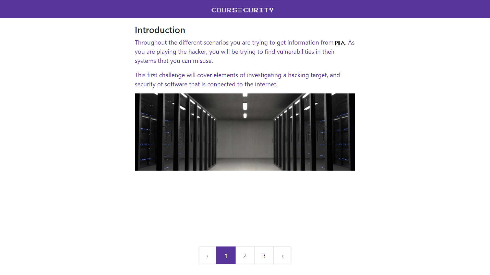
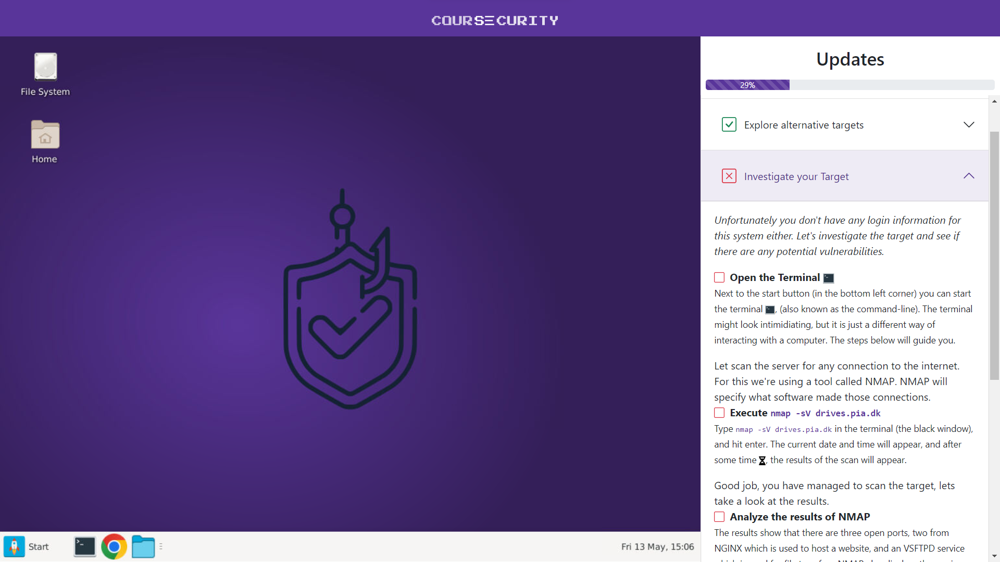
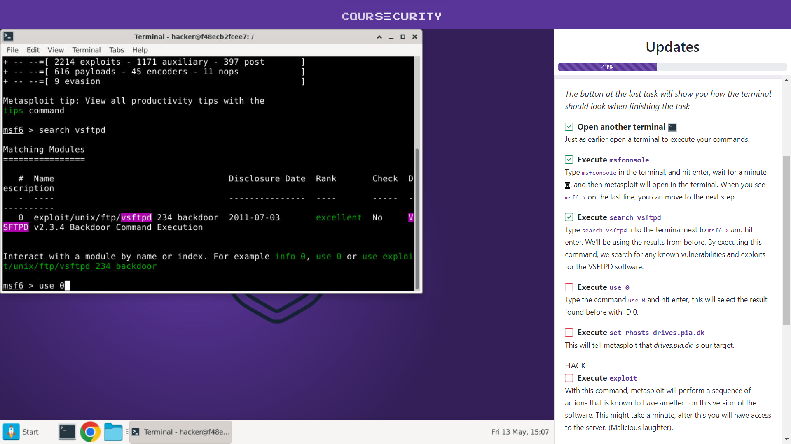
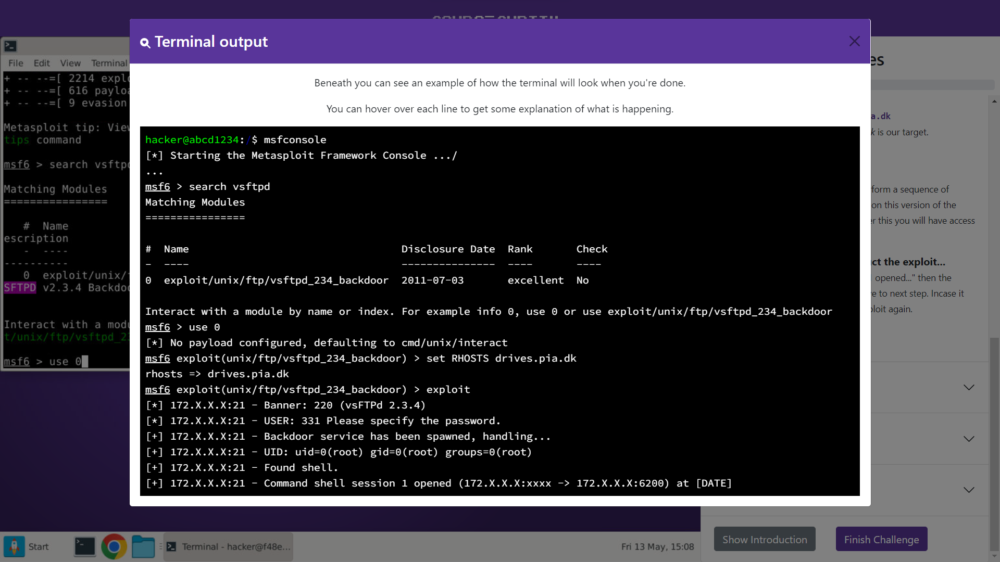
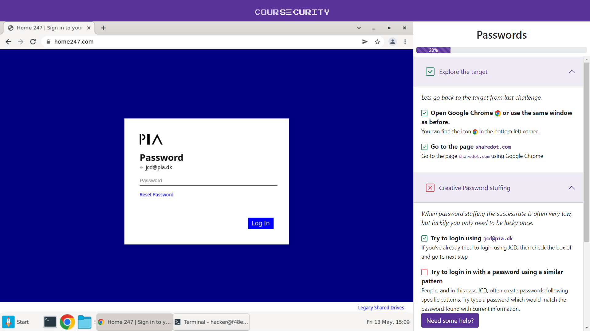

| 1 - Intro |
| --- |
||
| Intro that explains the upcoming challenge to the user, the outro that recaps what the user has done uses the same design. |

| 2 - Base of Prototype |
| --- |
||
| The base screen of the prototype, with left the Virtual Computer that the user has access to throughout the experience, and right the Guide that helps the user perform the correct actions. |

| 3a - Terminal | 3b - Terminal Help |
| --- | --- |
|||
| Example of the user accessing MetaSploit through the terminal running inside the virtual computer. | Example of the additional help available explaining the terminal to the user. |

| 4 - Browser displaying one of the targets |
| --- |
||
| Browser running inside the virtual computer, with one of the "victims" websites displayed.
